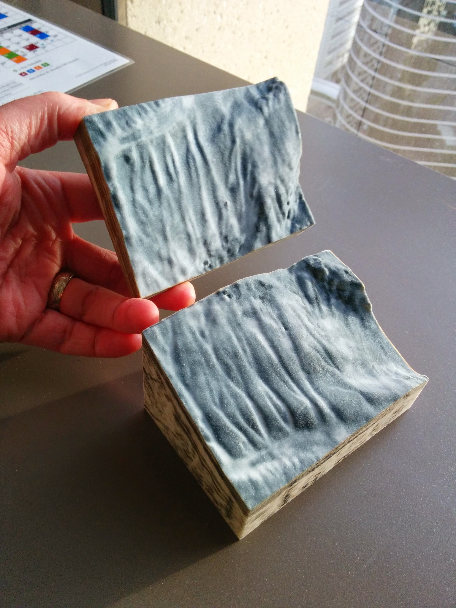

Touch Your Data: 3D Printing with Python
----------------------------------------

IPython notebook, examples, and data from my Scipy2015 Talk

Requires
--------
numpy
matplotlib
scipy
mayavi
PIL/Pillow
